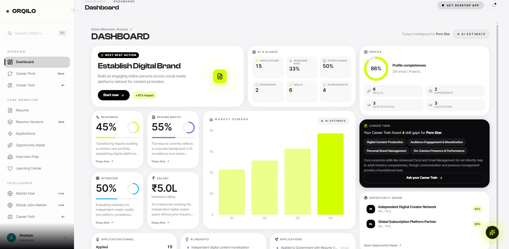
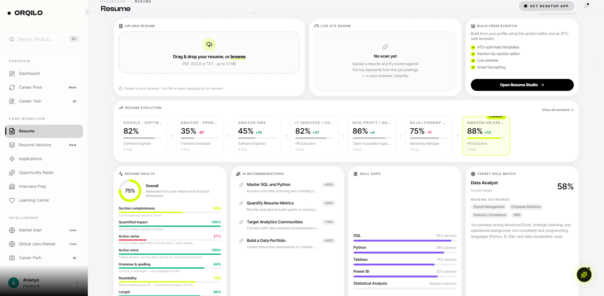
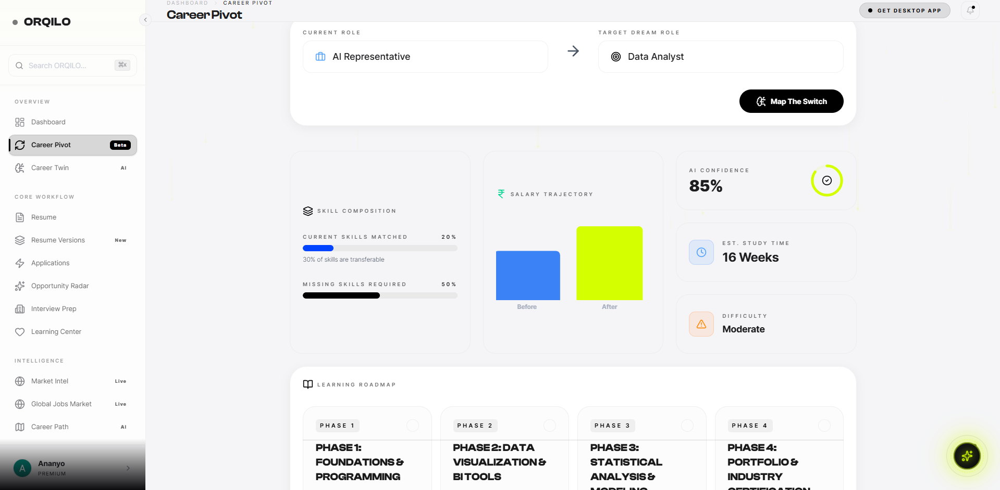
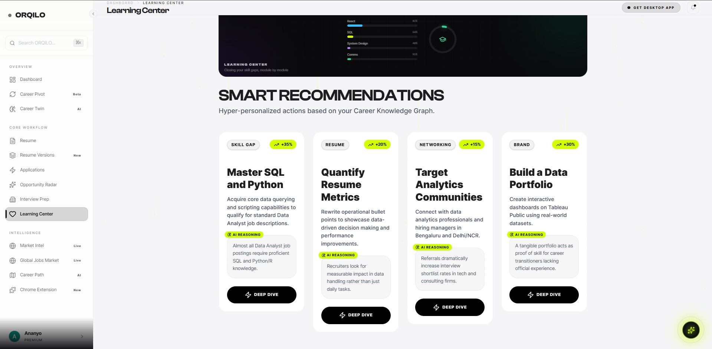
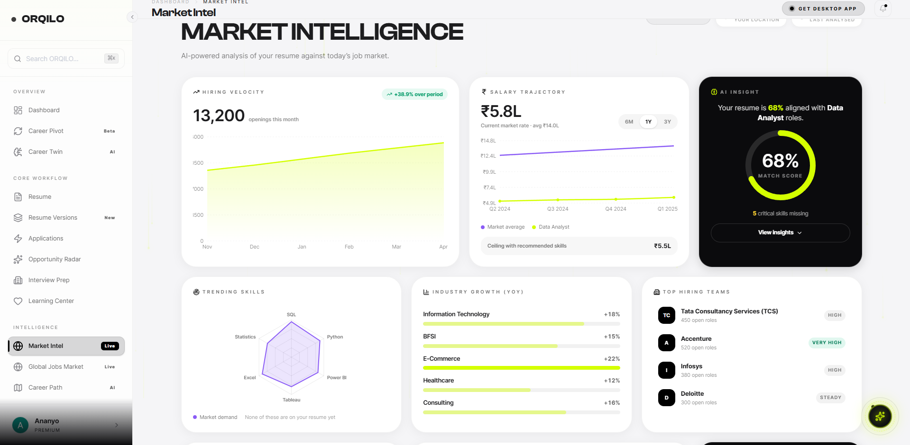

# ✦ ORQILO — AI Career Operating System

> **Your career should not be a document. It should be an intelligent system.**

ORQILO is an AI-powered career platform designed to help professionals **understand their career, build stronger professional profiles, discover relevant opportunities, and make smarter career decisions.**

From resume intelligence and ATS analysis to job discovery, career planning, and AI-powered recommendations — ORQILO brings the modern career journey into one intelligent platform.

[🌐 Visit ORQILO](https://orqilo.in)

---

## ✨ ORQILO in Action

### AI Career Dashboard



### Resume Intelligence



### Career Pivot Intelligence



### AI Learning Center



### Market Intelligence



---

## 🧠 What ORQILO Does

ORQILO is built around the idea that career management should be **continuous, personalized, and intelligent**.

### 📄 AI Resume Intelligence

Transform a basic resume into a stronger, role-focused professional profile.

* AI-powered resume generation
* ATS-focused resume analysis
* Resume optimization for target roles
* Resume scoring and improvement suggestions
* Multiple resume versions
* Resume history
* Professional resume downloads

### 🎯 Dream Role Intelligence

Tell ORQILO where you want your career to go.

ORQILO can analyze your current profile against your target role and help identify:

* Skill gaps
* Experience gaps
* Missing keywords
* Strengths to emphasize
* Areas that need improvement
* Potential career paths

### 🔎 AI Job Discovery

Discover opportunities based on your **career profile**, not just a job title.

ORQILO is designed to evaluate opportunities using:

**Experience + Skills + Target Role + Career Goals**

rather than relying only on basic keyword matching.

### 💼 LinkedIn Optimization

Strengthen your professional presence with AI-powered recommendations for:

* Headline
* About section
* Experience
* Skills
* Professional positioning
* Keyword alignment
* Personal career branding

### 🗺️ Personalized Career Roadmap

ORQILO aims to answer the most important career question:

> **"What should I do next?"**

Your career journey can be structured as:

**Current Profile → Skill Gaps → Learning → Projects → Experience → Target Role**

---

## 🔄 How ORQILO Works

```text
┌──────────────────────────┐
│       Your Profile       │
│ Resume + Skills + Goals  │
└────────────┬─────────────┘
             │
             ▼
┌──────────────────────────┐
│ Career Intelligence      │
│        Engine             │
└────────────┬─────────────┘
             │
      ┌──────┼──────┐
      ▼      ▼      ▼
   Resume   Jobs   Career
    AI    Discovery Intelligence
      │      │      │
      └──────┼──────┘
             ▼
┌──────────────────────────┐
│ Personalized Career     │
│ Recommendations          │
└────────────┬─────────────┘
             │
             ▼
┌──────────────────────────┐
│     Career Roadmap       │
└──────────────────────────┘
```

---

## 🧬 AI Career Twin

One of ORQILO's long-term directions is the **AI Career Twin**.

The goal is to build an intelligence layer that increasingly understands a person's professional identity over time.

It can learn from signals such as:

* Resume history
* Skills
* Professional experience
* Education
* Target roles
* Career interests
* Learning activity
* Career goals
* Opportunity preferences

The vision is simple:

> **An AI system that understands where you are, where you want to go, and what you should do next.**

---

## 📊 Career Intelligence

ORQILO is designed to bring together multiple career signals instead of treating them independently.

```text
                 PROFESSIONAL PROFILE
                         │
        ┌────────────────┼────────────────┐
        │                │                │
        ▼                ▼                ▼
      Skills          Experience        Goals
        │                │                │
        └────────────────┼────────────────┘
                         ▼
                CAREER INTELLIGENCE
                         │
        ┌────────────────┼────────────────┐
        ▼                ▼                ▼
    Job Match        Skill Gaps       Roadmap
        │                │                │
        └────────────────┼────────────────┘
                         ▼
                    NEXT ACTION
```

---

## ⚙️ AI & Automation

ORQILO explores the use of modern AI systems and workflow automation to create a more intelligent career experience.

Areas include:

* Large Language Models
* AI agents
* Resume parsing
* ATS analysis
* Job matching
* Career intelligence
* Workflow automation
* Personalized recommendations
* Automated notifications

---

## 🛠️ Technology

The ORQILO ecosystem is built around modern web, AI, and automation technologies.

### AI

* LLM integrations
* AI agents
* Resume intelligence
* Career analysis
* Recommendation systems

### Automation

* n8n
* API integrations
* Automated job discovery
* Email workflows
* AI-powered workflows

### Platform

* Modern web application
* Firebase
* GitHub
* Cloud-based services

---

## 🎥 Demo

See ORQILO in action:

▶️ **[Watch ORQILO Demo on YouTube](https://www.youtube.com/watch?v=yWnlpq3TjSI)**

---

## 🗺️ Roadmap

### ✅ Current

* AI Resume Generation
* ATS Resume Analysis
* Career Profile
* LinkedIn Optimization
* Job Discovery
* AI Career Recommendations
* Resume Versioning
* Career Intelligence Dashboard

### 🔨 In Development

* Advanced Job Matching
* Personalized Career Roadmaps
* Automated Job Workflows
* Deeper career analytics
* Application intelligence

### 🔮 Future

* AI Career Twin
* Long-term career memory
* Predictive career recommendations
* Career progression intelligence
* Personalized opportunity discovery
* Intelligent career decision support

---

## 🎯 The Vision

The traditional career stack is fragmented.

You maintain a resume in one place.

Search for jobs somewhere else.

Optimize LinkedIn separately.

Learn new skills on another platform.

And manually figure out what to do next.

ORQILO aims to connect these pieces.

### From

**Resume → Job Search → Apply → Hope**

### To

**Profile → Intelligence → Strategy → Action → Progress**

---

## 🚧 Project Status

**ORQILO is actively evolving.**

The platform is currently being developed with new AI-powered career features, automation workflows, and intelligent career planning capabilities.

---

## 🌐 Product

### ORQILO

**AI-powered career intelligence for the next generation of professionals.**

🌍 https://orqilo.in

---

## 📌 Repository

This repository serves as the **public-facing ORQILO project and product showcase**.

The production application and private implementation are maintained separately.

---

## 🤝 Connect

Learn more about ORQILO:

**Website:** https://orqilo.in

**GitHub:** https://github.com/ananyakantisarkar/ORQILO

